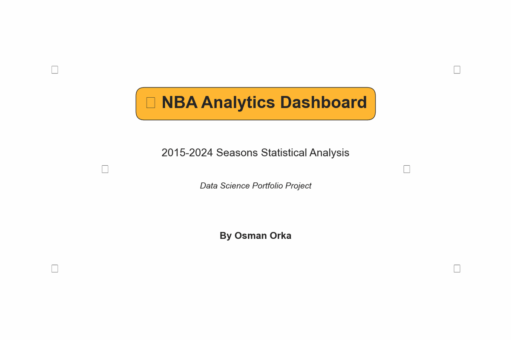

# 🏀 NBA Player Statistics Analysis (2015-2024)

A comprehensive data analysis project examining NBA player performance metrics, statistical relationships, and trends across 10 NBA seasons from 2015 to 2024.



## 🎯 Project Overview

This project provides in-depth statistical analysis of NBA player performance using data science techniques including data cleaning, exploratory data analysis, statistical correlation analysis, and advanced visualization. The analysis covers over 6,700 player records across 10 seasons and reveals key insights about player efficiency, position evolution, and statistical trends.

## 📊 Key Features

- **Multi-Season Analysis**: Comprehensive examination of 10 NBA seasons (2015-2024)
- **Position Evolution Tracking**: Analysis of how position distributions have changed over time
- **Statistical Trend Analysis**: Visualization of scoring, efficiency, and style changes
- **Advanced Visualizations**: Professional charts and heatmaps showing statistical relationships
- **Player Performance Metrics**: Custom efficiency ratings and advanced statistics
- **Team Comparisons**: Cross-team analysis of performance indicators
- **Position-Based Analysis**: Statistical breakdowns by player position

## 🛠️ Technologies Used

- **Python 3.13**: Core programming language
- **Pandas**: Data manipulation and analysis
- **NumPy**: Numerical computations
- **Matplotlib**: Data visualization
- **Seaborn**: Statistical data visualization
- **Jupyter Notebook**: Interactive analysis environment
- **SQL**: Database queries and analysis
- **Beautiful Soup**: Web scraping capabilities

## 📈 Analysis Highlights

### Dataset Statistics
- **6,700+ total player records** analyzed across 10 seasons
- **31 statistical categories** including points, rebounds, assists, shooting percentages
- **Custom metrics** including True Shooting %, Player Efficiency Rating (PER), and combined ratings

### Key Insights Discovered

#### 🏆 Statistical Trends (2015-2024)
- **Three-Point Revolution**: Visualization of the dramatic increase in 3-point attempts
- **Position Evolution**: Analysis of changing position distributions over time
- **Scoring Trends**: Examination of scoring patterns across seasons

#### 📊 Statistical Correlations
- Changing correlations between different metrics over time
- Position-specific performance patterns across seasons
- Efficiency evolution as the game has changed

#### 🏀 Team Analysis
- Cross-team performance comparisons 
- Team-specific position distribution strategies
- Evolution of team statistical profiles

#### 📍 Position-Based Insights
- **Traditional vs. Modern Centers**: Evolution of the center position
- **Point Guard Revolution**: Changed role of point guards in modern NBA
- **Position-less Basketball**: Emergence of versatile player profiles

## 🗂️ Project Structure

```
nba_analysis/
├── datasets/
│   ├── nba_player_stats_2015_16.csv
│   ├── ...
│   └── nba_player_stats_2023_24.csv
│   └── all_nba_player_stats_2015_2024.csv
├── sql_analysis/
│   ├── load_nba_data.sql
│   └── nba_stats_analysis.sql
├── images/
│   ├── position_distribution.png
│   ├── correlation_matrix.png
│   ├── top_scorers.png
│   ├── nba_analysis_demo.gif
│   └── scoring_efficiency.png
├── nba_scraper.py
├── merge_csv_files.py
├── create_animated_gif.py
├── generate_visualizations.py
├── requirements.txt
└── README.md
```

## 🚀 Getting Started

### Prerequisites
```bash
Python 3.8+
pip (Python package manager)
```

### Installation

1. **Clone the repository**
```bash
git clone https://github.com/ozzy2438/NBA-Analysis.git
cd NBA-Analysis
```

2. **Create virtual environment**
```bash
python -m venv venv
source venv/bin/activate  # On Windows: venv\Scripts\activate
```

3. **Install dependencies**
```bash
pip install -r requirements.txt
```

4. **Generate visualizations**
```bash
python generate_visualizations.py
```

## 📊 Data Sources

- **Basketball-Reference.com**: Primary source for player statistics
- **NBA Official Statistics**: Verification and supplementary data
- **Custom Web Scraping**: Automated data collection pipeline

## 🔍 Analysis Methodology

### 1. Data Collection & Consolidation
- Web scraping of statistics across 10 seasons
- Data consolidation into a unified dataset
- Consistent season identification and formatting
- Feature engineering for advanced metrics

### 2. Multi-Season Analysis
- Statistical trend identification
- Position distribution evolution
- Year-over-year comparison of key metrics
- Correlation pattern changes over time

### 3. Advanced Analytics
- Efficiency metric evolution
- Position-specific performance changes
- League-wide statistical pattern identification

### 4. Visualization & Insights
- Professional statistical visualizations
- Interactive charts and heatmaps
- Performance comparison dashboards
- Trend analysis and pattern identification

## 📱 Key Visualizations

The analysis includes several professional visualizations:

- **Animated GIF Dashboard**: Overview of key statistical findings
- **Position Evolution Charts**: Tracking changing positions over time
- **Statistical Trend Analysis**: Visualization of key metric changes
- **Efficiency Scatter Plots**: Advanced metric relationships
- **Correlation Heatmaps**: Statistical relationship analysis

## 🎯 Business Applications

This analysis provides valuable insights for:

- **NBA Teams**: Player evaluation and roster construction
- **Sports Analytics**: Advanced metric development
- **Fantasy Sports**: Player value assessment
- **Sports Media**: Data-driven storytelling
- **Betting Analysis**: Statistical trend identification

## 📊 SQL Analysis

The project includes comprehensive SQL analysis for:
- Multi-season trend analysis
- Complex joins and aggregations
- Performance metric calculations
- Evolution analysis over time

## 🔮 Future Enhancements

- **Machine Learning Models**: Predictive analytics for player performance
- **Real-time Data Integration**: Live statistics updates
- **Interactive Dashboard**: Web-based visualization platform
- **Historical Trend Analysis**: Multi-season comparison
- **Advanced Metrics**: Custom efficiency calculations

## 📈 Skills Demonstrated

- **Data Science**: End-to-end data analysis pipeline
- **Python Programming**: Advanced data manipulation and analysis
- **Statistical Analysis**: Correlation analysis and hypothesis testing
- **Data Visualization**: Professional chart creation and design
- **SQL**: Complex database queries and analysis
- **Web Scraping**: Automated data collection
- **Documentation**: Professional project presentation

## 👤 Author

**Osman Orka**
- Data Scientist & Analytics Professional
- Specializing in Sports Analytics and Statistical Modeling
- [GitHub](https://github.com/ozzy2438) | [LinkedIn](https://linkedin.com/in/osmanorka)

## 📄 License

This project is licensed under the MIT License - see the [LICENSE](LICENSE) file for details.

## 🙏 Acknowledgments

- Basketball-Reference.com for comprehensive NBA statistics
- NBA for official player and team data
- Python data science community for excellent libraries
- Sports analytics community for methodology inspiration

---

**⭐ If you found this analysis valuable, please star the repository!**

*This project demonstrates advanced data science capabilities including statistical analysis, data visualization, and insight generation from complex sports datasets.* 